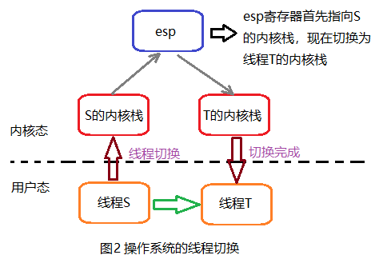

# Goroutine
- Introduction
  - 堆和栈：
    - 栈：执行期间编译器自动分配，编译器用它实现函数调用，调用函数时，栈增长，函数返回时，栈收缩。局部变量、函数参数、返回数据、返回地址等放在栈中
      - 栈的特点
        - 内存分配取决于编译器，用户栈在程序运行期间可以动态的扩展和收缩。
        - 数据从栈中的进出满足“后进先出”的规律。
        - 栈向低地址方向增长，esp（栈指针）指向栈顶元素。
    - 堆：动态储存器分配器维护着的一个进程的虚拟存储器区域。一般由程序员分配释放（堆在操作系统对进程初始化的时候分配），若程序员不释放，程序结束时可能由OS回收，每个进程，内核都维护着一个变量brk指向堆顶。
    - 栈和堆的区别
      - 栈内存存储的的是局部变量，堆内存存储的是实体。
      - 栈内存的更新的速度会更快些（局部变量），堆内存的更新速度相对更慢。
      - 栈内存的访问直接从地址读取数据到寄存器，然后放到目标地址，而堆内存的访问更麻烦，先将分配的地址放到寄存器，在读取地址的值，最后再放到目标文件中，开销更大。
      - 栈内存是连续的空间，堆内存一般情况不是连续的，频繁地开辟空间，释放空间容易产生内存碎片（外碎片）。
  - **goroutine是建立在线程之上的轻量级的抽象**。在Go语言中，当一个函数被创建为goroutine时，Go会将其视为一个独立的工作单元，并且能够以非常低的代价实现并发执行多个goroutine
  - goroutine创建和销毁的开销更小，由于线程创建时需要向操作系统申请资源，并且在销毁时将资源归还，因此它的创建和销毁的开销比较大。**但goroutine的创建和销毁是由go语言在运行时自己管理的**，因此开销更低。如下图所示。
  - goroutine与线程的区别
    - 线程：操作系统的线程的切换需要进行系统调用(内核态)，在高并发的场景下比较耗时耗资源。
    - goroutine相比于线程更加轻量化，关键点在于goroutine所占用的内存，均在栈中进行管理，而所占用栈空间的大小又是由runtime按需分配的，初始时只有2kb~8kb，当栈容量不够时会创建一个两倍旧栈大小的新栈，然后把旧栈的内容拷贝进来(连续栈机制, Go1.4之后开始使用)。
- **goroutine的并发调度模型——MPG**
  - CSP并发模型介绍：
    - 以通信的方式来共享内存
    - 将并发系统抽象为Channel和Process两部分，Channel用来传递消息，Process用于执行，Channel和Process之间相互独立，没有从属关系，消息的发送和接收有严格的时序限制
    - 在Go语言中Channel就是通道，用于通信，Process就是goroutine，用于执行
  - G：Go运行时对goroutine的抽象描述，G中存放并发执行的代码入口地址，上下文，运行栈等执行相关的元信息,G并不是执行体
  - M：时关联了OS内核线程的用户线程，是操作系统层面调度和执行的实体。M仅负责执行G。M启动时进入go运行时(runtime)的管理代码，获取G和P资源，然后执行调度。
  - P：P代表M运行G所需要的上下文环境，也是处理用户级代码逻辑的处理器。P本地持有G的队列(LRQ)