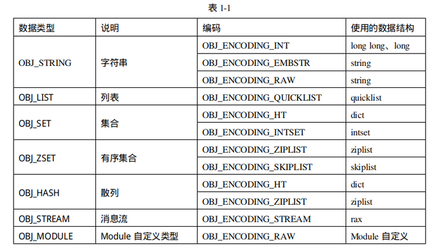

# Redis
- [what is Redis?](https://redis.io/)
## Data Struct
- 底层原理
  - redisObject：内部存储的数据定义的抽象类型
``` c
typedef struct redisObject {
    unsigned type:4;
    unsigned encoding:4;
    unsigned lru:LRU_BITS;
    int refcount;
    void *ptr;
};
```  
  - type：数据类型。
  - encoding：编码格式，即存储数据使用的数据结构。同一个类型的数据，Redis会根据数据量、占用内存等情况使用不同的编码，最大限度地节省内存。
  - refcount，引用计数，为了节省内存，Redis会在多处引用同一个redisObject。
  - **ptr**：指向实际的数据结构，如sds，真正的数据存储在该数据结构中。
  - lru：24位，LRU时间戳或LFU计数。
  - 
- String:动态字符串，会根据实际情况动态调整#
  - Redis限制了字符串的最大长度不能超过512MB
  - 实现方式
  - 扩容方式
    - 当 length 小于 1M 的时候，扩容规则将目前的字符串翻倍；如果 length 大于 1M 的话，则每次只会扩容 1M，直到达到 512M
- List
  - 支持的操作：
    - lpush: 从左边推入
    - lpop: 从右边弹出
    - rpush: 从右变推入
    - rpop: 从右边弹出
    - llen: 查看某个list数据类型的长度
  - Redis列表类型可以存储一组按插入顺序排序的字符串，它非常灵活，支持在两端插入、弹出数据，可以充当栈和队列的角色
  - ziplist是一种类似数组的紧凑型链表格式
  - 
  - <kbd></kbd>
- Set
- ZSet
- Hash
- Stream
- Module
## Persistence
## Data Synchronization
## Redis Cluster
## Best Practice